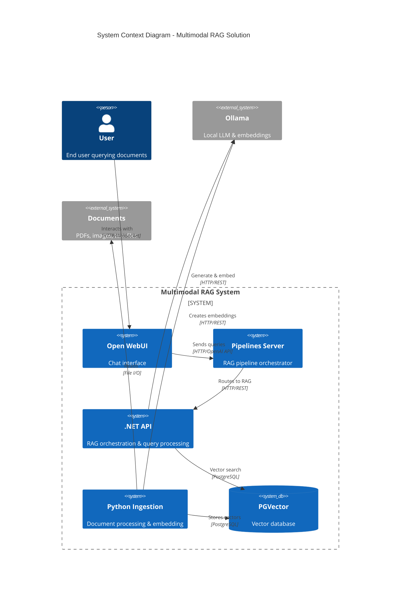
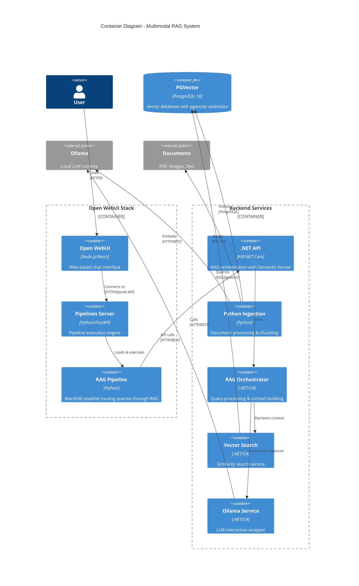
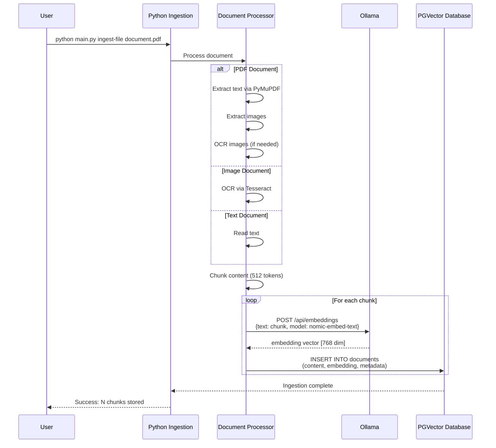
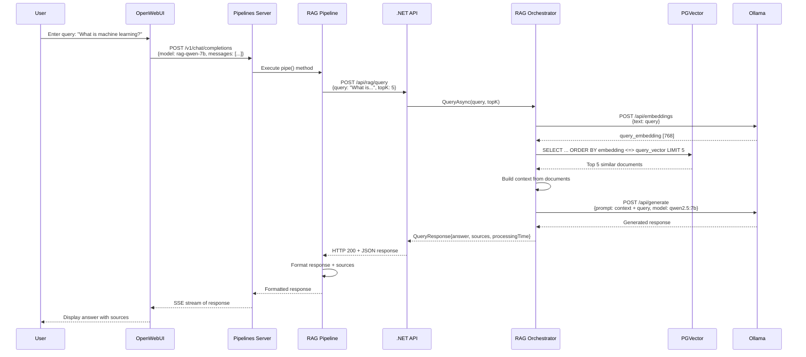
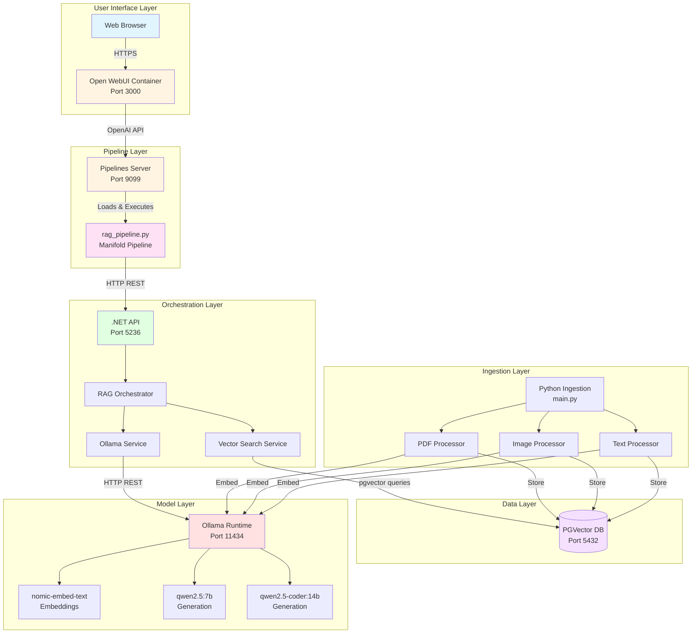

# Multimodal RAG Solution

Full-stack RAG (Retrieval-Augmented Generation) system with Python ingestion, .NET orchestration, Open WebUI Pipelines, and Ollama local models.

> **Built with:**
> - [Open WebUI](https://github.com/open-webui/open-webui) - User-friendly interface for LLMs
> - [Ollama](https://ollama.com/) - Local LLM runtime for privacy-focused AI
> - [Claude.ai](https://claude.ai/) - Solution architecture and implementation assistance
> - PGVector - PostgreSQL extension for vector similarity search
> - .NET & Python - Backend orchestration and document processing

## Table of Contents
- [Architecture Overview](#architecture-overview)
- [Prerequisites](#prerequisites)
- [Quick Start](#quick-start)
- [Component Details](#component-details)
- [Data Flow](#data-flow)
- [Configuration](#configuration)
- [Usage Examples](#usage-examples)
- [Troubleshooting](#troubleshooting)

---

## Architecture Overview

### C4 Model - System Context



### C4 Model - Container Diagram



---

## Data Flow

### Ingestion Flow



### Query Flow



### Component Interaction Diagram



---

## Prerequisites

- **Mac M4 Pro** (or similar ARM Mac)
- **Docker Desktop** or Podman
- **.NET 10 SDK** (or .NET 8+)
- **Python 3.11+**
- **Ollama** installed and running with models:
  - `nomic-embed-text` (embeddings)
  - `qwen2.5:7b` (generation)
  - `qwen2.5-coder:14b` (optional, for code-related queries)

### Install Ollama Models

```bash
ollama pull nomic-embed-text
ollama pull qwen2.5:7b
ollama pull qwen2.5-coder:14b
```

---

## Quick Start

### 1. Clone and Setup

```bash
# Clone the repository
git clone <your-repo-url>
cd multimodal-rag

# Make setup script executable
chmod +x start.sh

# Run automated setup
./start.sh
```

### 2. Start All Services

```bash
# Start database, pipelines, and Open WebUI
docker-compose up -d

# Or with Podman
podman compose up -d
```

### 3. Setup Python Ingestion

```bash
cd python-ingestion
python3 -m venv venv
source venv/bin/activate
pip install -r requirements.txt

# Initialize database schema
python main.py setup
```

### 4. Run .NET API

```bash
cd dotnet-orchestration/MultimodalRAG
dotnet restore
dotnet run
```

The API will start at `http://localhost:5236`

### 5. Configure Open WebUI Pipeline Connection

1. Open http://localhost:3000
2. Navigate to **Settings** → **Connections**
3. Click **"+ Add OpenAI API"** (NOT Ollama)
4. Configure:
   - **API Base URL**: `http://pipelines:9099/v1`
   - **API Key**: `0p3n-w3bu!`
   - **Name**: `RAG Pipelines`
5. Click **Verify** and **Save**

### 6. Select RAG Model in Chat

In the chat interface, select one of:
- **RAG + Qwen 2.5 7B**
- **RAG + Qwen 2.5 Coder 14B**

Now all your queries will use the RAG system!

---

## Component Details

### 1. Python Ingestion Service

**Location**: `python-ingestion/`

**Purpose**: Process and ingest documents into the vector database

**Key Features**:
- Multi-format support: PDF, images (PNG, JPG), text files
- Intelligent chunking with overlap
- Metadata extraction
- Parallel processing
- OCR for images using Tesseract

**Commands**:
```bash
# Setup database
python main.py setup

# Ingest single file
python main.py ingest-file /path/to/document.pdf

# Ingest directory
python main.py ingest-dir /path/to/documents

# Check database stats
python main.py stats
```

**Configuration**: `.env` file (see Configuration section)

### 2. .NET RAG Orchestration API

**Location**: `dotnet-orchestration/MultimodalRAG/`

**Purpose**: Handle RAG queries with vector search and response generation

**Key Components**:
- **RAGOrchestrator**: Main query processing logic
- **VectorSearchService**: pgvector similarity search
- **OllamaService**: LLM interaction wrapper

**Endpoints**:
- `POST /api/rag/query` - Full RAG query (retrieval + generation)
- `POST /api/rag/search` - Vector search only
- `GET /api/rag/health` - Health check
- `GET /api/rag/stats` - Database statistics
- `POST /api/rag/embed` - Get embeddings
- `POST /api/rag/generate` - Direct generation

**Swagger UI**: http://localhost:5236/swagger

### 3. Open WebUI Pipelines

**Location**: `open-webui-pipeline/`

**Purpose**: Route queries through the RAG system in Open WebUI

**Pipeline Type**: Manifold (provides multiple model endpoints)

**Key Features**:
- Automatic RAG enhancement for all queries
- Graceful error handling with fallback
- Source citation display
- Configurable via valves (in Open WebUI admin)

**Configuration Valves** (editable in UI):
- `RAG_API_URL`: URL of .NET API (default: `http://host.docker.internal:5236/api/rag`)
- `TOP_K`: Number of documents to retrieve (default: 5)
- `ENABLE_RAG`: Toggle RAG on/off (default: true)
- `SHOW_SOURCES`: Display source documents (default: true)
- `TIMEOUT`: API request timeout in seconds (default: 30)

**Models Provided**:
- `rag-qwen-7b` → RAG + Qwen 2.5 7B
- `rag-qwen-coder-14b` → RAG + Qwen 2.5 Coder 14B

### 4. PGVector Database

**Container**: `multimodal-rag-db`

**Purpose**: Vector similarity search with PostgreSQL

**Schema**:
```sql
CREATE TABLE documents (
    id SERIAL PRIMARY KEY,
    content TEXT NOT NULL,
    embedding vector(768),
    metadata JSONB,
    content_type VARCHAR(50),
    source_file VARCHAR(500),
    chunk_index INTEGER,
    created_at TIMESTAMP DEFAULT NOW()
);

CREATE INDEX ON documents USING ivfflat (embedding vector_cosine_ops);
```

**Connection**:
- Host: localhost
- Port: 5432
- Database: multimodal_rag
- User: raguser
- Password: ragpassword

### 5. Pipelines Server

**Container**: `pipelines`

**Purpose**: Execute Open WebUI pipelines

**Image**: `ghcr.io/open-webui/pipelines:main`

**Port**: 9099

**API Compatibility**: OpenAI-compatible endpoints

**Pipeline Discovery**: Auto-loads `.py` files from `/app/pipelines/`

---

## Configuration

### Environment Variables (.env for Python)

```bash
# Database Configuration
DB_HOST=localhost
DB_PORT=5432
DB_NAME=multimodal_rag
DB_USER=raguser
DB_PASSWORD=ragpassword

# Ollama Configuration
OLLAMA_HOST=http://localhost:11434
EMBEDDING_MODEL=nomic-embed-text
VISION_MODEL=qwen2.5-vl:7b
TEXT_MODEL=qwen2.5:14b

# Vector Dimension (nomic-embed-text = 768)
VECTOR_DIMENSION=768

# Chunking Settings
CHUNK_SIZE=512
CHUNK_OVERLAP=50
```

### .NET Configuration (appsettings.json)

```json
{
  "ConnectionStrings": {
    "DefaultConnection": "Host=localhost;Port=5432;Database=multimodal_rag;Username=raguser;Password=ragpassword"
  },
  "Ollama": {
    "BaseUrl": "http://localhost:11434",
    "EmbeddingModel": "nomic-embed-text",
    "GenerationModel": "qwen2.5:7b",
    "Temperature": 0.7,
    "TopK": 40,
    "TopP": 0.9
  },
  "VectorSearch": {
    "DefaultTopK": 5,
    "VectorDimension": 768
  }
}
```

### Docker Compose Services

```yaml
services:
  pgvector:       # PostgreSQL with pgvector extension
  pipelines:      # Open WebUI pipelines server
  open-webui:     # Chat interface
```

**Network**: All services share `rag-network` bridge network

**Volumes**:
- `pgvector_data`: Persistent database storage
- `open-webui-data`: Open WebUI data
- `./open-webui-pipeline`: Mounted pipeline files

---

## Usage Examples

### Ingest Documents

```bash
cd python-ingestion
source venv/bin/activate

# Single PDF
python main.py ingest-file ~/Documents/machine-learning.pdf

# Directory of documents
python main.py ingest-dir ~/Documents/research-papers

# Check what's been ingested
python main.py stats
```

### Query via API

```bash
# Full RAG query
curl -X POST http://localhost:5236/api/rag/query \
  -H "Content-Type: application/json" \
  -d '{
    "query": "What is gradient descent?",
    "topK": 5
  }'

# Search only (no generation)
curl -X POST http://localhost:5236/api/rag/search \
  -H "Content-Type: application/json" \
  -d '{
    "query": "neural networks",
    "topK": 3,
    "contentType": "pdf"
  }'

# Health check
curl http://localhost:5236/api/rag/health
```

### Query via Open WebUI

1. Open http://localhost:3000
2. Select **RAG + Qwen 2.5 7B** model
3. Ask: "What is machine learning?"
4. Response will include:
   - Generated answer based on your documents
   - Source citations with relevance scores
   - Processing time

---

## Troubleshooting

### Pipeline Not Showing in Open WebUI

**Symptom**: Models don't appear in chat interface

**Solutions**:
1. Verify pipelines server is running:
   ```bash
   docker logs pipelines
   # Should see: "Loaded module: rag_pipeline"
   ```

2. Check connection in Open WebUI:
   - Settings → Connections
   - Must be added as **OpenAI API**, not Ollama
   - URL: `http://pipelines:9099/v1`
   - API Key: `0p3n-w3bu!`

3. Restart pipelines server:
   ```bash
   docker restart pipelines
   ```

### RAG API Returning 500 Errors

**Symptom**: Queries fail with "RAG API error: HTTP 500"

**Solutions**:
1. Check .NET API is running:
   ```bash
   curl http://localhost:5236/api/rag/health
   ```

2. Verify Ollama is running:
   ```bash
   ollama list
   curl http://localhost:11434/api/tags
   ```

3. Check database connection:
   ```bash
   docker exec -it multimodal-rag-db psql -U raguser -d multimodal_rag -c "SELECT COUNT(*) FROM documents;"
   ```

4. View .NET logs for detailed errors

### Database Connection Issues

**Symptom**: "Cannot connect to database"

**Solutions**:
1. Ensure PGVector is running:
   ```bash
   docker ps | grep pgvector
   ```

2. Check health:
   ```bash
   docker exec multimodal-rag-db pg_isready -U raguser
   ```

3. Verify credentials in `.env` and `appsettings.json` match

### Ollama Model Not Found

**Symptom**: "model 'nomic-embed-text' not found"

**Solutions**:
1. Pull required models:
   ```bash
   ollama pull nomic-embed-text
   ollama pull qwen2.5:7b
   ollama pull qwen2.5-coder:14b
   ```

2. Verify models are loaded:
   ```bash
   ollama list
   ```

### Pipeline File Moved to `failed/` Directory

**Symptom**: Pipeline loads but immediately fails

**Solutions**:
1. Check logs:
   ```bash
   docker logs pipelines
   ```

2. Common issues:
   - Missing `pipelines()` method (not `pipes()`)
   - Missing `Pipeline` class
   - Syntax errors in Python code

3. Fix and restore:
   ```bash
   docker exec pipelines rm -rf /app/pipelines/__pycache__
   docker restart pipelines
   ```

---

## Development

### Running Tests

**.NET Tests**:
```bash
cd dotnet-orchestration/MultimodalRAG.Tests
dotnet test
```

**Python Tests**:
```bash
cd python-ingestion
pytest tests/
```

### Debugging

**Enable detailed logging in .NET**:
```json
{
  "Logging": {
    "LogLevel": {
      "Default": "Debug",
      "Microsoft.AspNetCore": "Debug"
    }
  }
}
```

**Monitor all container logs**:
```bash
docker-compose logs -f
```

---

## Performance Tuning

### Vector Search Optimization

Adjust index type for dataset size:

```sql
-- For small datasets (<100k vectors)
CREATE INDEX ON documents USING ivfflat (embedding vector_cosine_ops)
WITH (lists = 100);

-- For large datasets (>100k vectors)
CREATE INDEX ON documents USING ivfflat (embedding vector_cosine_ops)
WITH (lists = 1000);
```

### Chunking Strategy

Edit in `.env`:
```bash
# Smaller chunks = more precise but more DB records
CHUNK_SIZE=256
CHUNK_OVERLAP=25

# Larger chunks = more context but less precision
CHUNK_SIZE=1024
CHUNK_OVERLAP=100
```

### Pipeline Timeout

Adjust in pipeline valves (Open WebUI admin) or in code:
```python
TIMEOUT: int = Field(
    default=60,  # Increase for slower systems
    description="API request timeout in seconds"
)
```

---

## Security Considerations

1. **Change default credentials** in production:
   - Database password
   - Pipeline API key (`0p3n-w3bu!`)

2. **Enable authentication** in Open WebUI:
   ```yaml
   environment:
     - WEBUI_AUTH=true
   ```

3. **Use HTTPS** for production deployments

4. **Restrict network access** to only required services

5. **Regularly update** container images:
   ```bash
   docker-compose pull
   docker-compose up -d
   ```

---

## Acknowledgments

This solution was built using the following open-source and commercial technologies:

### Core Technologies
- **[Open WebUI](https://github.com/open-webui/open-webui)** - Extensible, feature-rich web interface for LLMs with support for pipelines and functions. Licensed under MIT.
- **[Ollama](https://ollama.com/)** - Run large language models locally with ease. Enables privacy-focused AI without cloud dependencies.
- **[PGVector](https://github.com/pgvector/pgvector)** - Open-source vector similarity search extension for PostgreSQL.

### Development & Architecture
- **[Claude.ai](https://claude.ai/)** by Anthropic - AI assistant used for solution architecture, implementation guidance, and documentation. This project benefited from Claude's expertise in system design, code structure, and technical documentation.

### Models
- **Qwen 2.5** by Alibaba Cloud - High-performance open-source language models
- **Nomic Embed Text** - Open-source embedding model optimized for semantic search

### Special Thanks
- Open WebUI community for the excellent pipelines framework
- Ollama team for making local LLM deployment accessible
- Anthropic for Claude.ai's architectural and coding assistance

---

## License

This project is provided as-is with no restrictions on use, modification, or distribution. Feel free to use, adapt, and build upon this solution for any purpose, commercial or non-commercial.

### Component Licenses

Please note that this solution integrates various open-source and proprietary components, each with their own licenses:

- **Open WebUI**: MIT License
- **Ollama**: MIT License
- **PGVector**: PostgreSQL License (similar to MIT/BSD)
- **.NET**: MIT License
- **Python Libraries**: Various open-source licenses (see `requirements.txt`)
- **Qwen Models**: Apache 2.0 License
- **Nomic Embed**: Apache 2.0 License

When using this solution, ensure you comply with the licenses of the individual components.

### Attribution

While not required, attribution is appreciated. If you use this solution in your work, consider mentioning:
- This repository and its contributors
- The technologies listed in the Acknowledgments section

## Contributing

Contributions are welcome! This project was built with the goal of being a practical, production-ready RAG solution.

### How to Contribute

1. **Bug Reports**: Open an issue describing the bug and steps to reproduce
2. **Feature Requests**: Share your ideas for improvements or new features
3. **Code Contributions**:
   - Fork the repository
   - Create a feature branch
   - Make your changes with clear commit messages
   - Submit a pull request with a description of your changes

### Areas for Contribution

- Additional document processors (Word, Excel, etc.)
- Performance optimizations
- Additional pipeline configurations
- Enhanced error handling and monitoring
- Documentation improvements
- Test coverage expansion

All contributions will be reviewed and acknowledged.

## Support

For issues and questions:
- GitHub Issues: [your-repo-url/issues]
- Documentation: [link to wiki/docs]
